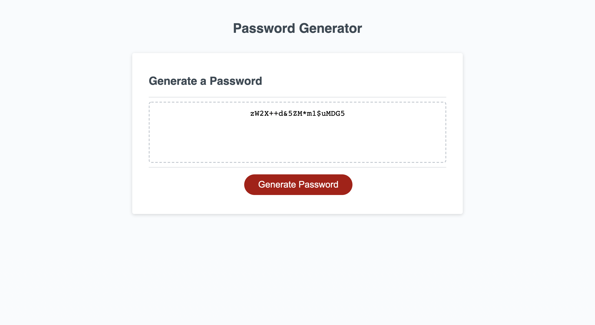
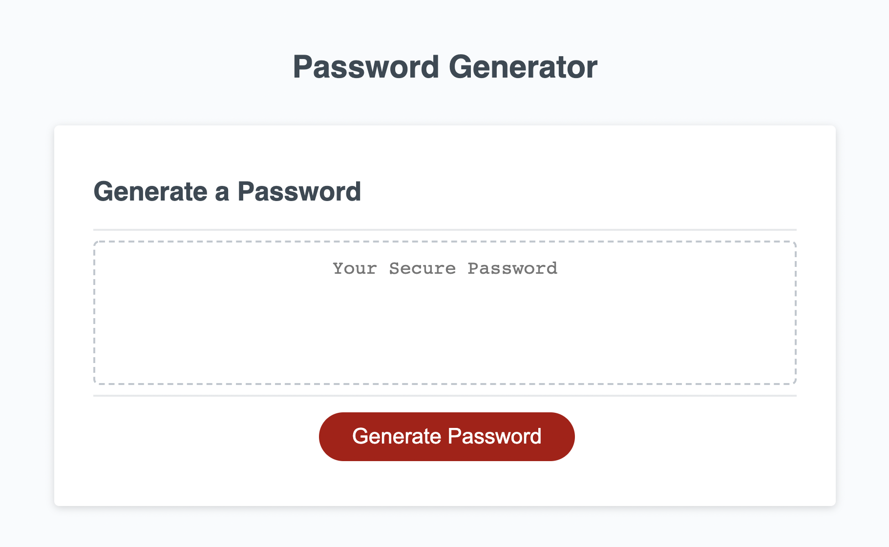
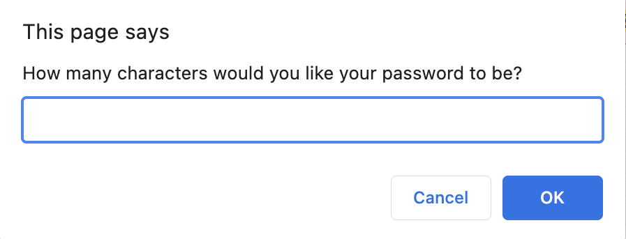

# password-generator
A simple password generator

# <Password-Generator>
## Description
Link to deployed application: https://madisonailani.github.io/password-generator/

I built this project in order to have a password generator on hand. It is important to have one of these because common passwords are easy to guess and can leave you vulnerable to cyber attacks. With a randomly generated password, you don't have to worry about someone being able to guess it easily. While doing this project, I learned about do/while loops and their functionality. I also got better at functions in javascript. 

## Usage
To use this, all you have to do is click the "Generate Password" button and the first alert will pop up. 

From here, you have to answer the alerts and the password will be displayed in the box.
